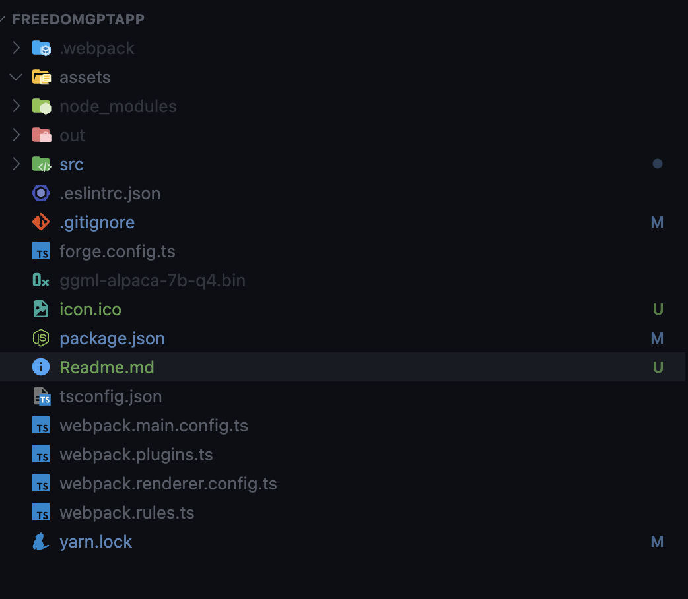

# Freedom GPT

# Installing Node.js for an Electron App

To run an Electron app, you'll need to have Node.js installed on your computer. If you don't already have Node.js installed, you can download it from the official website:

[Download Node.js](https://nodejs.org/en/download/)

Once you've downloaded and installed Node.js, you can start the Electron app using either Yarn or npm.

## Using Yarn

If yarn is not installed you can install with

`npm install -g yarn`

After you have Yarn installed, you can start the Electron app by running the following command in your terminal:

`yarn install`

## Changing src/index.ts file

`src/index.ts`

Go ahead and change the CHAT_APP_LOCATION to map it to your chat executable which you can install from

[CPP File Executable Download](https://github.com/antimatter15/alpaca.cpp/releases)

## Changing PORT

We are using port `3000` for the `express server` you can change it in the same file
`src/index.ts`

## ggml-alpaca-7b-q4.bin

## Make sure this is installed in the root of your project

Download the zip file corresponding to your operating system from the [latest release](https://github.com/antimatter15/alpaca.cpp/releases/latest). On Windows, download `alpaca-win.zip`, on Mac (both Intel or ARM) download `alpaca-mac.zip`, and on Linux (x64) download `alpaca-linux.zip`.

Download [ggml-alpaca-7b-q4.bin](https://huggingface.co/Sosaka/Alpaca-native-4bit-ggml/blob/main/ggml-alpaca-7b-q4.bin) and place it in the same folder as the `chat` executable in the zip file. There are several options:

Once you've downloaded the model weights and placed them into the same directory as the `chat` or `chat.exe` executable, run:

## Running application

If you followed all the steps, you can run the program by giving the following command

`yarn start`
